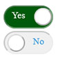

# lovely-toggle-switch

A React switch component to toggle status.

## Installation

```bash
npm install lovely-toggle-switch
```
## Usage
```bash
import React from 'react';
import ToggleSwitch from 'lovely-toggle-switch';

function MyComponent() {
  const [isSwitchOn, setSwitchOn] = useState(false);

  return (
    <ToggleSwitch
      keyId="myToggle-unique-id"
      checked={true} // Set to `false` for an unchecked switch
       onChange={() => {
         // Your custom logic
          setSwitchOn(!isSwitchOn);
      }}
      disabled={false} // Set to `true` to disable the switch
    />
  );
}


```
## Props:
* keyId (required): A unique identifier for the toggle switch.
* checked: A boolean indicating whether the switch is initially checked or not.
* onChange: A callback function that will be called when the switch state changes.
* disabled: A boolean indicating whether the switch is disabled or not.



## License
This project is licensed under the MIT License - see the LICENSE.md file for details.

## Author
Lovenish Goyal

Changelog
See the CHANGELOG file for details about changes.

