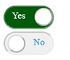

# lovely-toggle-switch

A toggle switch component compatible with React, Angular, Vue, and vanilla JavaScript.
- [lovely-toggle-switch](https://www.npmjs.com/package/lovely-toggle-switch)@1.0.6

## Installation

```bash
npm install lovely-toggle-switch
```

## Usage

### React Component (Default)

The default export is the React component. Works with all React-based frameworks.

### Web Component (Framework-Agnostic)

For Angular, Vue, or vanilla JavaScript, use the Web Component version.

---

## Framework Examples

Click on your framework to see the implementation:

<details open>
<summary><b>⚛️ React / JSX</b></summary>

```jsx
import React, { useState } from 'react';
import ToggleSwitch from 'lovely-toggle-switch';

function MyComponent() {
  const [isSwitchOn, setSwitchOn] = useState(false);

  return (
    <ToggleSwitch
      id="myToggle-unique-id"
      checked={isSwitchOn}
      onChange={(e) => {
        setSwitchOn(e.target.checked);
      }}
      disabled={false}
    />
  );
}
```

</details>

<details>
<summary><b>🚀 Next.js (App Router)</b></summary>

```jsx
'use client'; // Required for Next.js App Router

import { useState } from 'react';
import ToggleSwitch from 'lovely-toggle-switch';

export default function Page() {
  const [checked, setChecked] = useState(false);

  return (
    <ToggleSwitch
      id="nextjs-toggle"
      checked={checked}
      onChange={(e) => setChecked(e.target.checked)}
    />
  );
}
```

</details>

<details>
<summary><b>📘 TypeScript / TSX</b></summary>

```tsx
import React, { useState } from 'react';
import ToggleSwitch from 'lovely-toggle-switch';

const MyComponent: React.FC = () => {
  const [checked, setChecked] = useState(false);

  return (
    <ToggleSwitch
      id="typescript-toggle"
      checked={checked}
      onChange={(e) => setChecked(e.target.checked)}
    />
  );
};
```

</details>

<details>
<summary><b>🅰️ Angular</b></summary>

```typescript
// app.component.ts
import { Component } from '@angular/core';

@Component({
  selector: 'app-root',
  template: `
    <toggle-switch
      id="angular-toggle"
      [checked]="isChecked"
      (change)="onToggleChange($event)"
    ></toggle-switch>
  `
})
export class AppComponent {
  isChecked = false;

  onToggleChange(event: CustomEvent) {
    this.isChecked = event.detail.checked;
  }
}
```

```typescript
// main.ts or app.module.ts
import 'lovely-toggle-switch/web';
```

</details>

<details>
<summary><b>💚 Vue 3</b></summary>

```vue
<template>
  <toggle-switch
    id="vue-toggle"
    :checked="isChecked"
    @change="handleChange"
  ></toggle-switch>
</template>

<script setup>
import { ref } from 'vue';
import 'lovely-toggle-switch/web';

const isChecked = ref(false);

const handleChange = (event) => {
  isChecked.value = event.detail.checked;
};
</script>
```

</details>

<details>
<summary><b>🌐 Vanilla JavaScript</b></summary>

```html
<!DOCTYPE html>
<html>
<head>
  <script type="module">
    import 'lovely-toggle-switch/web';
  </script>
</head>
<body>
  <toggle-switch
    id="vanilla-toggle"
    checked
  ></toggle-switch>

  <script>
    const toggle = document.querySelector('toggle-switch');
    toggle.addEventListener('change', (event) => {
      console.log('Switch is:', event.detail.checked);
    });
  </script>
</body>
</html>
```

</details>

## Props (React Component):

* **id** (required): A unique identifier for the toggle switch.
* **checked**: A boolean indicating whether the switch is initially checked or not. Default: `false`
* **onChange**: A callback function that will be called when the switch state changes. Receives a React change event.
* **disabled**: A boolean indicating whether the switch is disabled or not. Default: `false`
* **onLabel**: Custom label text when switch is ON. Default: `'Yes'`
* **offLabel**: Custom label text when switch is OFF. Default: `'No'`
* **backgroundColor**: Custom background color when unchecked (CSS color value)
* **checkedBackgroundColor**: Custom background color when checked (CSS color value)
* **knobColor**: Custom color for the toggle knob (CSS color value)
* **offColor**: Custom text color when unchecked (CSS color value)
* **onColor**: Custom text color when checked (CSS color value)

## Attributes (Web Component):

* **id**: A unique identifier for the toggle switch (recommended for accessibility)
* **checked**: Boolean attribute - present when checked
* **disabled**: Boolean attribute - present when disabled
* **on-label**: Custom label text when switch is ON. Default: `'Yes'`
* **off-label**: Custom label text when switch is OFF. Default: `'No'`
* **background-color**: Custom background color when unchecked
* **checked-background-color**: Custom background color when checked
* **knob-color**: Custom color for the toggle knob
* **off-color**: Custom text color when unchecked
* **on-color**: Custom text color when checked

## Events (Web Component):

* **change**: Fired when the switch state changes. Event detail contains `{ checked: boolean, value: boolean }`

## Preview



## License
This project is licensed under the MIT License - see the LICENSE.md file for details.

## Author
Lovenish Goyal

Changelog
See the CHANGELOG file for details about changes.

